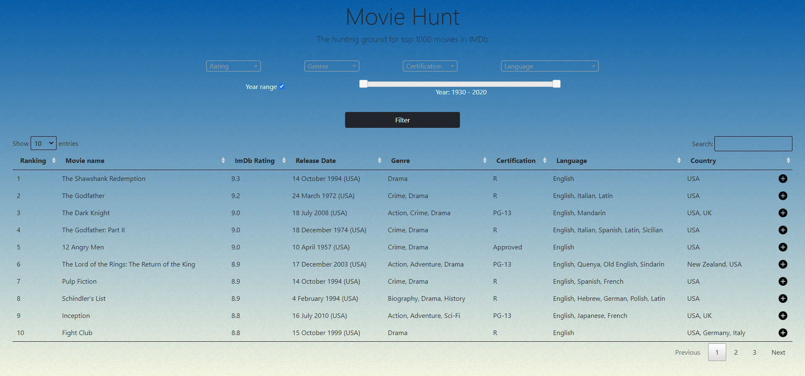

# Django Application for web scraping | Recommendation System
## Here's what the project is all about:
- Scrape data of top 1000 movies in IMDb website.
- Filter or search movies from the scraped data based on customizable criteria.
- Select one or multiple movies and the recommendation system would fetch similar movies with matching attributes.
- Plot the movies as data points on a 3-dimensional space to visualise the closeness of similar movies based on their attributes.

---
## Recommendation System

---
## Movies as data points in an interractive 3-D scatter plot

